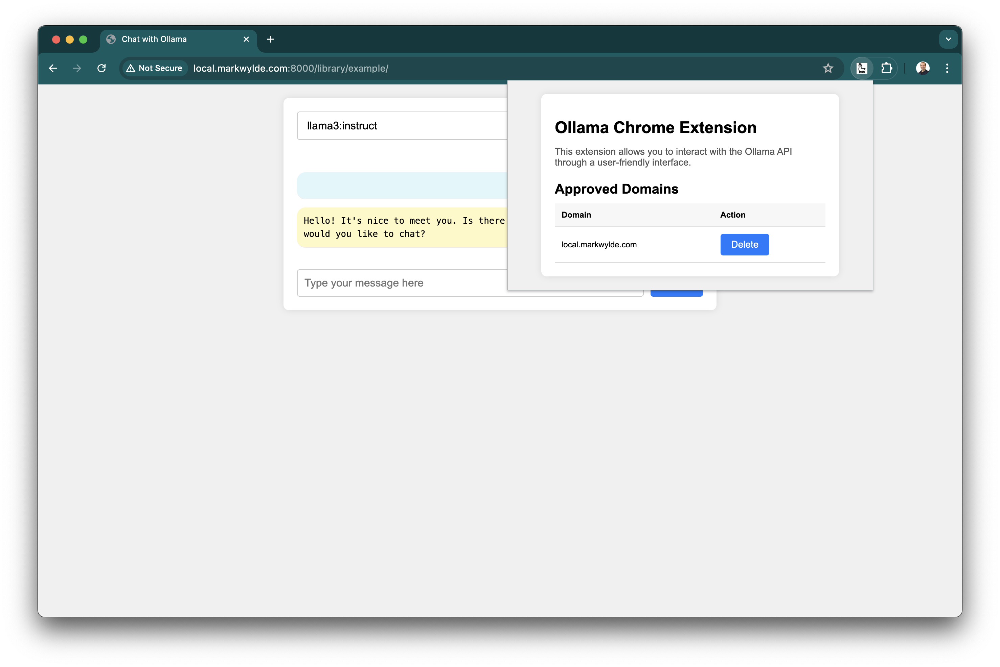

# ollama-chrome-api

`ollama-chrome-api` is a Chrome Extension designed to allow any website to communicate with the users locally running Ollama instance, directly on the users machine.

It allows websites to communicate securely by explicitly requiring authorization on a per domain basis.

This should allow you to make a completely serverless, client only chat web ui, so long as the user can install the Chrome Extension and Ollama.

## Features

- **Authorization**: Handle authorization requests and responses.
- **Fetch**: Support for using fetch to directly communicate with Ollama.

## Screenshot



## Installation

### Chrome Extension

Download the [ollama-chrome-api](https://chromewebstore.google.com/detail/ollama-chrome-api/eeceimooeojijecjhjedodbhimcfgiif) extension from the Chrome Webstore.

## Usage

You simply talk to Ollama using fetch on `localhost:11434`.

The first time each domain makes this request, an authorize window will popup asking the user to approve or deny the request.

```javascript
const response = await fetch('http://localhost:11434/api/chat', {
  method: 'POST',
  headers: {
    'Content-Type': 'application/json'
  },
  body: JSON.stringify({
    model,
    messages: chatMessages
  })
});
```

## License

This project is licensed under the MIT License.

## Contributing

This is a very rough idea and needs lot more work. Contributions are welcome! Please feel free to submit a pull request or open an issue to discuss changes.
