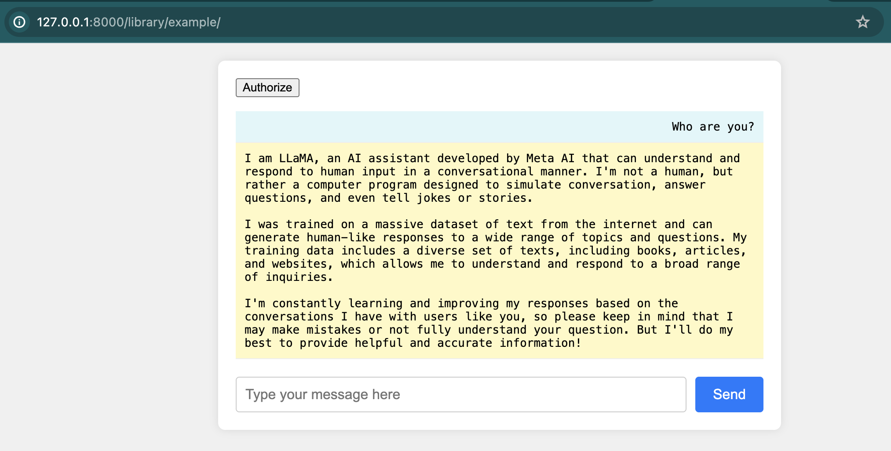

# ollama-chrome-api

`ollama-chrome-api` is a Chrome Extension and a JavaScript library designed to facilitate interaction with the Ollama API through a Chrome extension or any web-based environment.

It allows websites to communicate securely (explicit authorization is required on a per site basis) with a locally running Ollama instance, directly on the visitors machine.

This should allow you to make a completely serverless, client only chat web ui, so long as the user can install the Chrome Extension and Ollama.

## Features

- **Authorization**: Handle authorization requests and responses.
- **Streaming**: Support for streaming responses from the Ollama API.
- **Event-driven**: Utilizes custom events for communication between different parts of your application.

## Screenshot



## Installation

### Chrome Extension

I'm currently trying to get the extension added to the Chrome Web Store, but in the mean time you can download it and install the extension in dev mode. More information is in the [extension](./extension/) README.

### Library

I have built an ES Module library and published on npmjs.

To install the `ollama-chrome-api` library, you can use npm:

```bash
npm install ollama-chrome-api
```

## Usage

### Authorization

The `authorize` function sets up an event listener for the `OllamaResponse` event and dispatches an `OllamaRequest` event to initiate the authorization process.

```javascript
import { authorize } from 'ollama-chrome-api';

document.getElementById('authorize').onclick = async () => {
  await authorize();
};
```

### Generating Responses

The `OllamaClient` class allows you to generate responses from the Ollama API. It handles the streaming of responses and processes each chunk of data.

```javascript
import { ollamaRequest } from 'ollama-chrome-api';

const stream = ollamaRequest({
  url: '/api/chat',
  method: 'post',
  headers: {
    'content-type': 'application/json'
  },
  body: {
    model: 'llama3',
    messages: [
      { role: 'user', content: 'Who are you' }
    ],
    stream: true
  }
});

for await (const chunk of stream) {
  console.log(chunk.message.content);
}
```

## License

This project is licensed under the MIT License.

## Contributing

This is a very rough idea and needs lot more work. Contributions are welcome! Please feel free to submit a pull request or open an issue to discuss changes.
